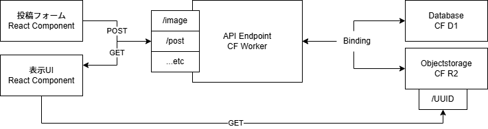
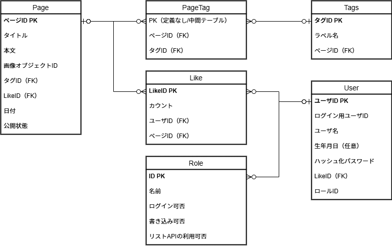

# Cfblog-practice

Cloudflare Pages/D1/R2を使ったブログのユースケースプラクティス

## アーキテクチャ

### コンポーネント図

- API Endpoint: CF Workerが投稿用フォームと表示用フォームの2つの口を持つ
- Database/Objectstorage: CF WorkerとはBindingによって疎通する
- 表示UI: D1とはAPI Endpointを介して、R2とはR2自体のエンドポイントを介して情報取得する
- 投稿フォーム: 執筆時点では認証は検討/実装されていない

## データベース設計

- Page: ページを管理。Likeとタグの外部キーを持つ
    - 投稿者は管理者のみであるため、ユーザへのリレーションを持たない。
- Tag: タグ、ページに紐づく。
- PageTags: ページとタグの中間テーブル
- Like: ページで投下されたユーザごとのLike
- User: 閲覧ユーザ

## セットアップ

### 事前準備

WorkersへAPIのセットアップ実施
[api/README.md](./api/README.md)を参照

