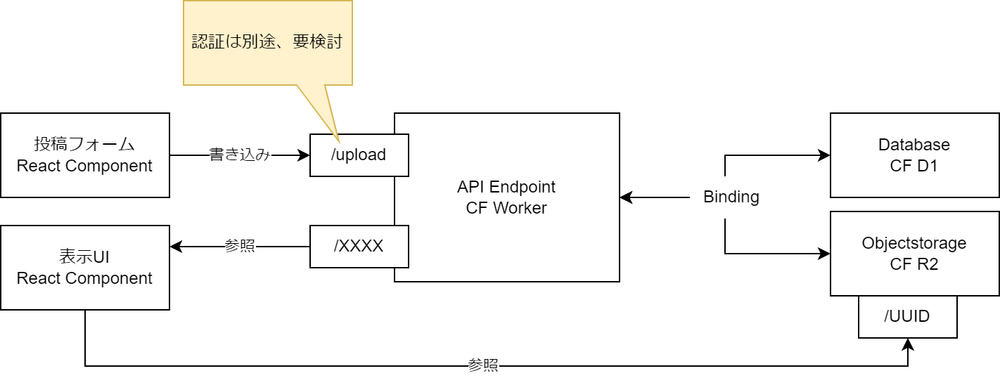
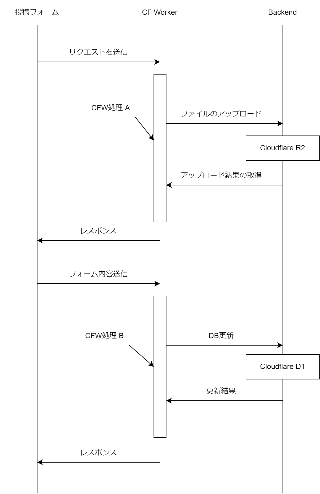
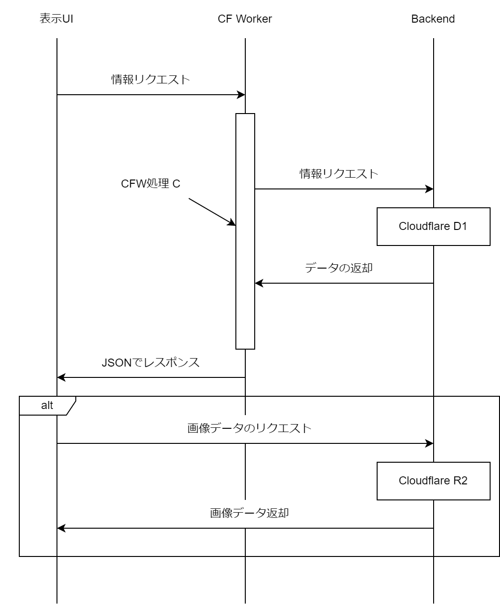

# Cfblog-practice

Cloudflare Pages/D1/R2を使ったブログのユースケースプラクティス

## アーキテクチャ

### コンポーネント図

- API Endpoint: CF Workerが投稿用フォームと表示用フォームの2つの口を持つ
- Database/Objectstorage: CF WorkerとはBindingによって疎通する
- 表示UI: D1とはAPI Endpointを介して、R2とはR2自体のエンドポイントを介して情報取得する
- 投稿フォーム: 執筆時点では認証は検討/実装されていない

### 処理フロー

ブログ投稿時の処理フロー

- CFW処理 A: 画像を受信しR2へファイルをアップロード、キーをリスポンス
- CFW処理 B: DB情報を受信しDBを更新、D1への書き込み結果をレスポンス

ブログ閲覧時の処理フロー

- CFW処理 C: DBの何らかの識別子を元に情報をリクエスト、R2のキーを含む（または含まない）データを返却
    - R2のキーを含む場合は、表示UIはR2へリクエスト

## セットアップ

### 事前準備

WorkersへAPIのセットアップ実施
[api/README.md](./api/README.md)を参照

